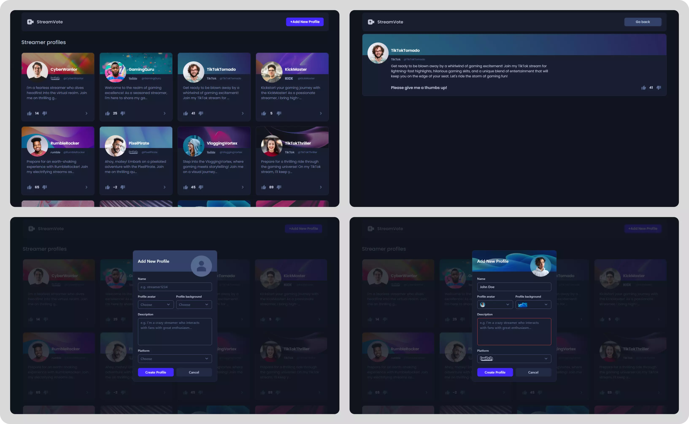

# StreamVote - Streamer spotlight app

App where you can add new streamer profiles and vote for existing profiles. While on the main page, the user can go to the streamer's page where he can find more information about the given content creator.

## Table of contents

- [Introduction](#introduction)
- [Technologies](#technologies)
- [Features](#features)
- [Installation and launch](#installation-and-launch)
- [License](#license)

## Introduction

The application consists of a frontend and a backend (both written in TypeScript).

At the beginning I designed the UI of the application using [Figma](https://www.figma.com/ui-design-tool/ "Figma Page"). I downloaded the icons using the [Iconify](https://iconify.design/ "Iconify Page") plugin. All photos come from free content from [Unsplash](https://unsplash.com/ "Unsplash Page"). To work with existing data, I created a package of 20 fake profiles using AI.

I built the frontend of the application in React using the Next.js + Tailwind CSS framework. I used axios for http requests.

I used Express.js to build the backend, MongoDB as the database and Mongoose. To enable real-time updating on the server and on the client side, I used Socket.io.



## Technologies

- [Next.js](https://nextjs.org/ "Next.js Page")
- [TypeScript](https://www.typescriptlang.org/ "Typescript Page")
- [Tailwind CSS](https://tailwindcss.com/ "Tailwind CSS Page")
- [Tailwind Animated](https://www.tailwindcss-animated.com/ "Tailwind Animated Page")
- [Axios](https://axios-http.com/ "Axios Page")
- [Node.js](https://nodejs.org/en "Node.js Page")
- [Express.js](https://expressjs.com/ "Express.js Page")
- [MongoDB](https://www.mongodb.com/ "MongoDB Page")
- [Mongoose](https://mongoosejs.com/ "Mongoose Page")
- [Socket.io](https://socket.io/ "Socket.io Page")
- [Docker](https://www.docker.com/ "Docker Page")

## Features

- Realtime updates
- Form validation
- Server-side validation, such as the inability to add a new streamer when there is already a profile with a given name on the same platform
- Profile voting
- Loading, error, and empty states

## Installation and launch

To run the application, follow these steps:

1. Open Docker Desktop to start the Docker service.
2. Navigate to the backend folder in your terminal.
3. Run the following command to start the backend server using Docker Compose. This will start the MongoDB database.

```bash
docker-compose up -d
```

4. Once the docker is up and running, navigate to the backend folder again.
5. Install the required dependencies and start the backend server by running the following commands:

```bash
npm install
npm run dev
```

6. Now, navigate to the frontend folder in another terminal window/tab.
7. Install the required dependencies and start the frontend development server by running the following commands:

```bash
npm install
npm run dev
```

You should now have the application up and running locally. You can access it by visiting http://localhost:3000 in your browser.

Please make sure that Docker is running and the required ports (e.g., 3000 for the frontend, 8000 for the backend) are not occupied by other applications on your system.

> **Note**
> When connecting to the database, the application checks whether the streamers collection exists or is empty. If so, it fills it with 20 fake profiles. To opt out of this functionality for development purposes, please remove or comment line 46 in the main index.ts.

```javascript {line-numbers}
43 (async () => {
44 	 try {
45     await mongoose.connect(DB_URL);
46     // await fillDatabaseIfEmpty();
47
48     httpServer.listen(PORT, () => console.log(`Running on port ${PORT}`));
49   } catch (error: any) {
50     console.error("Server error:", error.message);
51   }
52 })();
```

> **Note**
> The upvote/downvote function is supported by the endpoint with the PUT method. In order to optimize the sending of the request, I do not send the entire object for update. Instead, on the server side, I only update the selected item as it should be in the PATCH method.

> **Note**
> In addition to streamer profile data like name, description, platform and avatar, I also added a profile background only because I think it adds value to the UI of the frontend application.

## License

[MIT](https://choosealicense.com/licenses/mit/)
